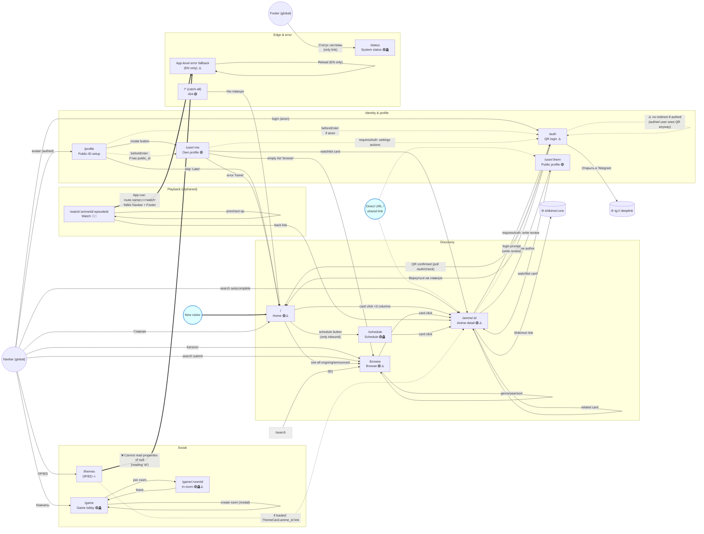
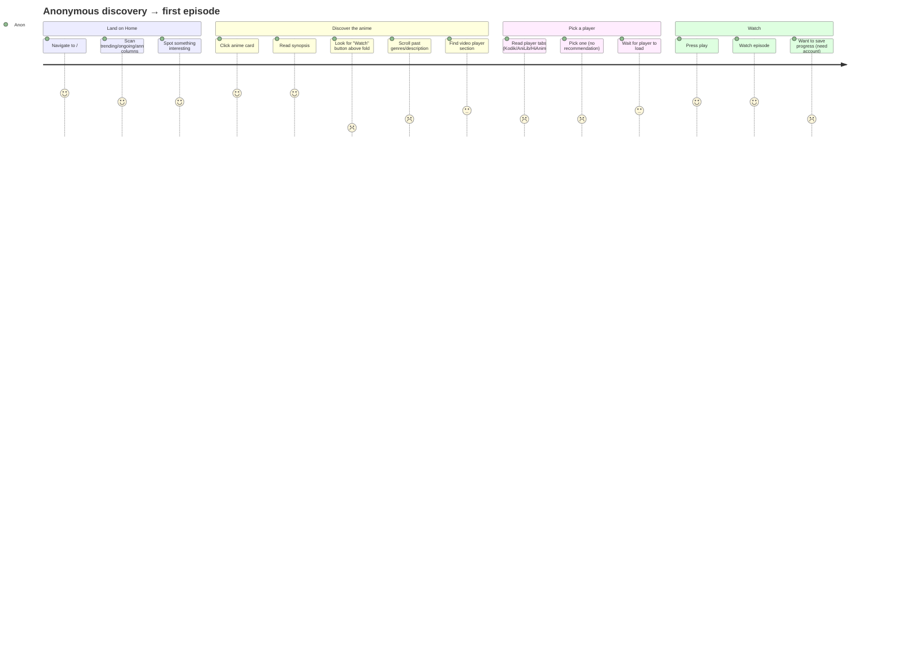
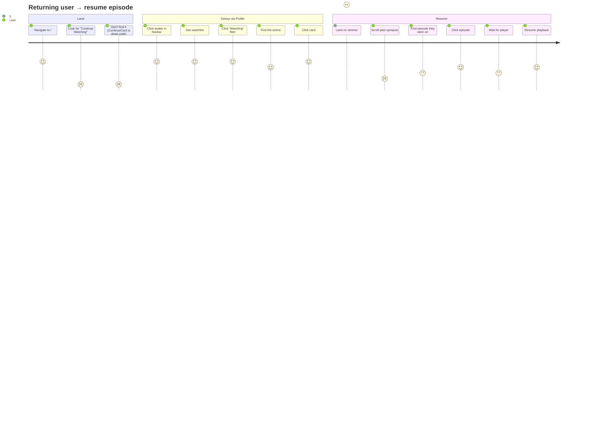
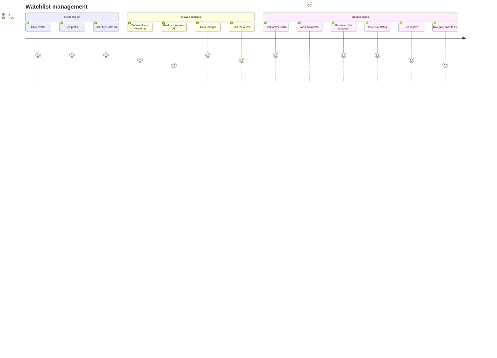
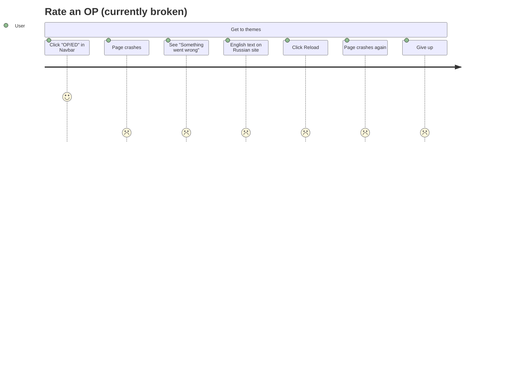
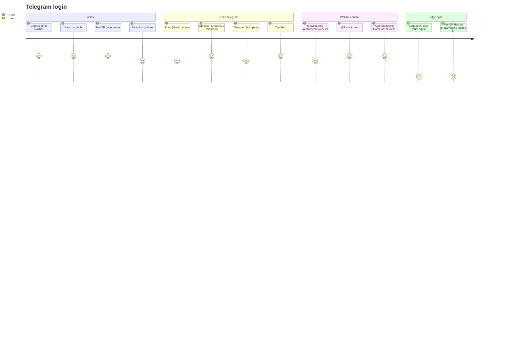

# AnimeEnigma — UX Map

> **Last updated:** 2026-04-08
> **Method:** Code inventory of `frontend/web/src/router`, `frontend/web/src/views/*.vue`, `frontend/web/src/components/layout/*.vue` + browser verification of every route on production (https://animeenigma.ru) as `ui_audit_bot`.
> **Scope:** Public-facing routes only. Admin views (`/admin/*`) and player internals are out of scope.
> **Reference audit:** [docs/issues/ui-audit-2026-04-07.md](issues/ui-audit-2026-04-07.md). Findings tagged `UA-NNN` below correspond to entries in that document.

This map is a living artefact. When the screen graph or a flow changes, update both this file and the audit doc — they reference each other and drift fast.

---

## Legend

| Marker | Meaning |
|---|---|
| 🟢 | Healthy node — verified rendering correctly on production |
| 🔥 | **Broken** — crashes or throws on load |
| 🧟 | **Orphan** — exists in router but no UI links to it (only reachable by typing the URL) |
| 🪦 | **Dead-end** — no outgoing transitions; user can only escape via the global Navbar |
| ⚠️  | Has at least one logged finding (UX-NNN) |
| 🌐 | External destination (leaves the SPA) |

---

## 1. Screen state graph

The full site as a directed graph. Edges are labelled with what triggers them.

### What the graph reveals

1. 🔥 **`/themes` is in the primary Navbar but crashes on every load** (UA-024). Affects roughly 1 in 4 of every Navbar click. Root cause: themes API returns `{data: null, success: true}` for the current season; `fetchThemes` does `themes.value = resp.data?.data || resp.data || []` which falls through to the envelope object; v-for then iterates the object's `data` property whose value is `null`, triggering `null.id`.
2. 🧟 **`/watch/` is fully orphaned** (UA-025). Confirmed earlier: `ContinueCard.vue` is the only component that links to it, and `ContinueCard` is exported from `components/anime/index.ts` but **never imported by any view**. Reachable only by typing the URL. Slated for deletion as part of follow-up work.
3. 🪦 **Four dead-end nodes**: Schedule, Status, GameRoom, and (when reachable) Themes have no outgoing transitions. Once the user lands on them, the only way to leave is the global Navbar — fine for Status, but Schedule should at least link back to Home via a "see what's airing today" callout, and GameRoom should let users browse anime/check their list without losing the room state.
4. 🚪 **Schedule has only one inbound edge — the Home page button** (UA-026). It's not in the Navbar at all. Users discovering the site via direct anime links will never know `/schedule` exists.
5. 🚪 **Status has only one inbound edge — the footer link** (UA-026). Same problem at higher severity since the footer is itself low-discoverability.
6. ⚠️ **Auth has no redirect-if-authed guard** (UA-027). A logged-in user navigating to `/auth` (e.g. via a stale browser tab, an autocomplete suggestion, or a "log in" link they click out of habit) sees a fresh QR code instead of being bounced to Home. The Navbar even shows their avatar in the corner while the page asks them to log in.
7. ⚠️ **`/game/:roomId` for a non-existent room silently falls back to the lobby** (UA-028). Stale invite links produce no error; the user is dropped into an empty lobby thinking the system is broken or that someone hijacked their link.
8. ⚠️ **The status page reports `/themes` as healthy at 1ms response** while the page is catastrophically broken (UA-029). The status check is service-liveness only; it does not verify that data flows correctly. This is a meta-bug — the very page meant to surface outages is itself unable to detect them.
9. ⚠️ **App-level error fallback is hardcoded English** ("Something went wrong" / "Reload") on a Russian-locale site (UA-030). Confirmed visible on the broken `/themes` page.
10. ⚠️ **The footer has only one link** (`/status`) — no About, Contact, Terms, Privacy, Help, or even a Catalog/Home back-link (UA-031). For a content site this is unusually thin.
11. ⚠️ **`App.vue` line 66** sets `isFullscreen = route.name === 'watch'` and uses it to hide both Navbar AND Footer when on the dead `/watch/` route. Once `/watch/` is deleted, this computed and the v-if guards on Navbar/Footer become dead code that can be removed.

---

## 2. Route inventory

| Route | View file | Auth | Linked from | Outgoing | Status | Findings |
|---|---|---|---|---|---|---|
| `/` | `Home.vue` | ❌ | Navbar, NotFound, AppError, Auth, all "go home" links | → Browse, Schedule, AnimeDetail | 🟢 | UA-001..006, UA-031 |
| `/auth` | `Auth.vue` | ❌ (anon expected) | Navbar (login), AnimeDetail (write review), ProfileSetup (anon guard), ProfileOwn (anon guard) | → Home, tg:// (external) | 🟢 | UA-027 (no redirect-if-authed) |
| `/browse` | `Browse.vue` | ❌ | Navbar, Home (see-all), `/search` 301, ProfileOwn (empty state) | → AnimeDetail, self (filters/pagination) | 🟢 | UA-002 |
| `/search` | (router redirect only) | ❌ | Old MAL/MAL-import URLs, external links | → Browse (301) | 🟢 | — |
| `/anime/:id` | `Anime.vue` | ❌ (some actions need auth) | Home, Browse, Schedule, ProfileOwn, ProfileOther, Themes (when loaded), Watch (back link), Navbar search autocomplete | → AnimeDetail (related), ProfileOther (review author), Auth (review prompt), shikimori.one | 🟢 | UA-013, UA-014, UA-015 |
| `/watch/:animeId/:episodeId` | `Watch.vue` | ❌ | **NONE** (orphan — only direct URL) | → AnimeDetail (back), self (prev/next ep) | 🧟🔥 | UA-019..023 + UA-025 (dead route) |
| `/profile` | `ProfileSetup.vue` | ✅ | Navbar avatar (when no public_id) | → Home (skip), ProfileOwn (after save), Auth (anon) | 🟢 | — |
| `/schedule` | `Schedule.vue` | ❌ | **Home page button only** | → AnimeDetail | 🟢🪦 | UA-026 (one entry point) |
| `/themes` | `Themes.vue` | ❌ (rate needs auth) | **Navbar (primary)** | → AnimeDetail (theme.anime_id link, when loaded) | 🔥 | **UA-024 (catastrophic)** |
| `/game` | `Game.vue` (lobby mode) | ❌ (room actions need auth) | Navbar | → GameRoom | 🟢🪦 | — |
| `/game/:roomId` | `Game.vue` (room mode) | ❌ | Game lobby | → GameLobby (leave) | 🟢🪦 | UA-028 (silent fallback for invalid room) |
| `/user/:publicId` | `Profile.vue` | ❌ (own settings need auth) | Navbar avatar, AnimeDetail review authors, public profile share links | → AnimeDetail, Browse, Home, AvatarUploadModal | 🟢 | — |
| `/status` | `StatusPage.vue` | ❌ | **Footer only** | (none) | 🟢🪦 | UA-026, UA-029 (reports broken Themes as healthy) |
| `/* (catch-all)` | `NotFound.vue` | ❌ | (typo / dead links) | → Home | 🟢 | — |

---

## 3. Per-screen state coverage

For each route, which user-facing states are implemented? Empty cells = not implemented and **probably should be**.

| Route | Loading | Empty | Error | Loaded | Anon vs authed | Mobile-specific | Notes |
|---|:---:|:---:|:---:|:---:|:---:|:---:|---|
| Home | ✅ skeletons | ✅ "no data" | (no per-section error UI) | ✅ | ❌ same content | ✅ 1/2/3-col grid | UA-002 (no error UI per section) |
| Browse | ✅ spinner | ✅ icon + text | ✅ error + retry | ✅ | watchlist actions hidden if anon | ✅ 2-6 col grid, stacked filters | — |
| Auth | ✅ spinner + state | n/a | ✅ "expired" + retry | ✅ QR ready | n/a (anon expected) | ✅ centered card | UA-027 (no authed→home redirect) |
| AnimeDetail | ✅ spinner | n/a | ✅ generic error + retry | ✅ | review form vs login prompt | ✅ stacked hero on mobile | UA-013, UA-014 |
| Watch | ✅ spinner | n/a | ✅ generic error + retry | ✅ | ❌ same | ✅ episode snap-scroll | dead route — irrelevant |
| ProfileSetup | ✅ saving spinner | n/a | ✅ inline error | ✅ form | n/a (auth-required) | ✅ centered card | — |
| ProfileOwn | ✅ spinner | ✅ "browse catalog" | ✅ error + home link | ✅ | settings tab visible | ✅ stats grid + table/grid | — |
| ProfileOther | ✅ spinner | ✅ no list | ✅ error + home link | ✅ | (no settings tab) | ✅ same as own | — |
| Schedule | ✅ spinner | ✅ "no data" | ❌ no error UI | ✅ day groups | ❌ same | ✅ 1-4 col grid | **No error state** — silent failure on API error |
| Themes | ✅ spinner | ✅ "no themes" + admin hint | ✅ error + retry | ✅ ThemeCard list | rating UI hidden if anon | ✅ single column | **Crashes before any state renders** — UA-024 |
| Game | ✅ spinner | ✅ "no rooms" + create CTA | ❌ no error UI | ✅ list / in-room | room actions auth-gated | ✅ stacked panels | No error state for socket failure; UA-028 (no "room not found" state) |
| Status | ✅ initial | n/a | ✅ red banner | ✅ all green grid | ❌ same | ✅ 1-3 col | Auto-refresh every 30s |
| NotFound | n/a | n/a | n/a | ✅ static | ❌ same | ✅ centered | — |
| App-error fallback | n/a | n/a | ✅ shown when child throws | n/a | ❌ same | ✅ centered | UA-030 (English-only) |

**Patterns visible across the table:**

- **Schedule and Game are missing error states** — silent failures on backend issues. Schedule.vue has no `v-else-if="error"` block at all; Game.vue has none for socket disconnects.
- **No view distinguishes between "list is empty" and "API returned malformed data"** — both fall into the same empty branch in most views, making debugging hard. (The Themes crash is an extreme case of this — instead of an empty state, the view crashes because it can't tell `null` from `[]`.)
- **Anon vs authed switching is inconsistent**: AnimeDetail shows a clean "log in to write a review" prompt; Themes silently hides the rating UI without explanation; Game silently fails on socket connect.

---

## 4. Customer journey maps

Five journeys covering the most common user paths. Each step is scored 1–5 for friction, where **5 = smooth** and **1 = friction or failure**. Friction notes link to audit findings.

### 4.1 First-visit anonymous → start watching

Fresh user lands on Home, looking for an anime they've heard about, wants to start episode 1.

**Friction:**
- No "Watch episode 1" CTA above the fold on `/anime/:id` (UA-013) — drops the score from 5 to 1
- Player tab choice has no guidance — anonymous users have no idea which player to pick (UA-014)
- No way to save progress without logging in, but no prompt to log in until they want to do something the system blocks

### 4.2 Returning user resumes from history

Logged-in user returns wanting to continue an in-progress anime.

**Friction:**
- **Home has no "Continue Watching" section** despite the existence of `ContinueCard.vue` — it's coded but never mounted. Users have to detour through Profile → Watchlist → filter → click → scroll → click. 5 extra steps to do what should be 1.
- The Watch view that the orphaned `/watch/` route was supposed to host is the "right" place for episode-level resume, but it's dead.

### 4.3 Watchlist management

User wants to update statuses on their list — mark something completed, drop another.

**Friction:**
- Default filter is Watching, not All — users coming to manage their list have to click an extra pill on every visit (minor)
- Status changes happen on the AnimeDetail page, not inline on the watchlist — every status change is a 4-click round trip
- No bulk operations — no "select 5 anime, mark all completed"

### 4.4 OP/ED rating (broken end-to-end)

User wants to rate an opening they liked.

**This entire journey is unreachable for users until UA-024 is fixed.** The `/themes` page is in the primary Navbar but crashes on every load.

### 4.5 Telegram OAuth login

New user clicks "log in", goes through the QR / Telegram bot flow.

**Friction:**
- 298s expiry with no warning — if user gets distracted, they have to start over
- No fallback for users without Telegram (other than direct API key from admin)
- UA-027: visiting `/auth` while already authed shows the QR instead of redirecting to Home

---

## 5. What changed since the previous map

The previous version of this file (commit history available via `git log docs/UX_MAP.md`) was last touched before several major refactors and is wildly out of sync. Compared to the previous map, this rewrite **adds** the following routes and **corrects** the following stale claims:

**Added (the previous map didn't list them at all):**
- `/themes` — Themes / OP/ED ratings (a primary Navbar item!)
- `/user/:publicId` — Public profiles
- `/status` — System status page
- `/game/:roomId` — In-room game state
- `/* catch-all` 404 page
- `/auth` — Telegram QR login
- `/profile` — Public-ID setup view (separate from `/user/:publicId`)
- App-level error fallback as a node

**Corrected:**

| Old map said | Reality |
|---|---|
| Auth has username + password form | **QR-only Telegram login.** API supports password login but the UI does not surface it. |
| Profile has Watchlist + History + Settings tabs | **Only Watchlist + Settings.** No History tab. |
| Settings includes "Reduce Motion" and "Default Quality" | These don't exist in the Settings tab (probably never built or removed in a refactor) |
| `/search` is a top-level page | It's a 301 redirect to `/browse?q=...` |
| AnimeDetail has only the Kodik player | It has 4 player tabs (Kodik / AniLib / HiAnime / Consumet) plus an 18+ tab for hentai. |
| `/watch/` is a real, reachable page with episode navigation, autoplay, and quality selector | It's **orphaned dead code** with no UI entry point — UA-025. |
| API `GET /users/me` | Actual: `GET /auth/me` |
| API `GET /reviews/:animeId` | Actual: `GET /anime/:animeId/reviews` |

---

## 6. Cross-cutting findings from the mapping pass

These were discovered during the inventory + browser walk and are filed as new entries in the audit doc. See [docs/issues/ui-audit-2026-04-07.md](issues/ui-audit-2026-04-07.md) for the full template (severity, evidence, fix).

| ID | Severity | Title |
|---|---|---|
| **UA-024** | 🔥 **Catastrophic** | `/themes` crashes on every load due to backend `null` + frontend type-coercion bug |
| **UA-025** | Major | `/watch/` route is fully orphaned dead code (resolves 5 prior findings via deletion) |
| **UA-026** | Minor | Schedule and Status are reachable from one entry point each (Home button, footer link) — invisible to most users |
| **UA-027** | Major | `/auth` has no redirect-if-authed guard — logged-in users see a fresh QR code |
| **UA-028** | Minor | `/game/:roomId` silently falls back to the lobby for invalid room IDs (no error message) |
| **UA-029** | Major | `/status` reports `/themes` as healthy at 1ms while it is catastrophically broken — service-liveness only, no end-to-end check |
| **UA-030** | Minor | App-level error fallback in `App.vue` is hardcoded English on a Russian-locale site |
| **UA-031** | Cosmetic | Footer has only one link (`/status`) — no About / Contact / Terms / Help |
| **UA-032** | Minor | Schedule and Game views have no error states (silent failure on backend issues) |
| **UA-033** | Cosmetic | `App.vue` `isFullscreen = route.name === 'watch'` is dead code once `/watch/` is deleted |

---

## 7. How to keep this map current

This document is the single source of truth for "what pages does AnimeEnigma have and how do users move between them?" It is not auto-generated. It will go stale fast unless the rules below are followed.

**When to update this file:**
- A new route is added or removed in `frontend/web/src/router/index.ts` → add/remove it from § 1, § 2, § 3
- A new top-level link, button, or auto-redirect is added to a view → add the edge in § 1
- A new state is added to a view (loading / empty / error / etc.) → tick the box in § 3
- A user flow changes (e.g. signup is no longer Telegram-only) → revise the relevant journey in § 4
- An entry in § 6 is fixed → strike through the row and update the audit doc

**When to NOT trust this file:**
- After a major refactor that touches more than one view → re-run the inventory pass before relying on it
- After more than ~30 days have passed since the last update — ping me for a re-verification pass

The mapping methodology that produced this document is captured in `CLAUDE.md` under "UI/UX Audit Framework" and can be re-run from there at any time as `ui_audit_bot`.
